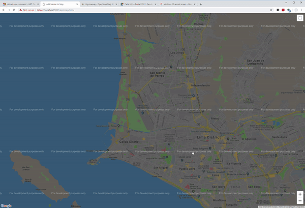

## fast

This is a project for collecting the AI tools we build on my stream at [https://twitch.tv/nick_larsen](https://twitch.tv/nick_larsen).

The fun parts are the map and some work on making BLAS fast in dot net.



### Getting the directions finding map demo running

#### Step 1: download some data to run the map

In the datasets folder there is a python script called `grab-city.py` which you can use to pull the data from any city on one of the [osm data dump pages](https://download.bbbike.org/osm/bbbike/).  Just call the script as follows and replace `Glasgow` with your city name of choice.  Grab the name exactly as it is shown on that page.  This needs to be run probably as python 2.7 and I have not tested it with python 3.X.

```
python grab-city.py -n Glasgow
```

This will create the folder for you and download the files you need for the next step.

#### Step 2: change the `map_data_city_filename` in Startup.cs

The `map_data_city_filename` in fast.webapi/Startup.cs constant tells the app which city to load data for.  This should be the same city name (capitalization might matter) as you used to download the map data (e.g. `Glasgow`).

#### Step 3: dotnet run

Browse to the fast.webapi folder in a terminal and then fire off a `dotnet run` to get it started.  As it loads, it will tell you when it is done loading the map data.  If it throws an error, please fell free to post an issue on the repo with full details (copy/pasted) from the terminal output.

#### Step 4: visit the site

Once it's done loading, you should be able to hit the site locally at `https://localhost:5000` or whatever it tells you in the terminal.

#### Step 5: find your city and start clicking

By default the map zooms in on wherever I left it last.  If you want to browse around the city you loaded data for, you just need to scroll to that location on the map and then start clicking.  When you click the first time, nothing will happen visibly, but it sets the location.  When you click the second time, it does a search and finds directions to plot.  Then it plots them.  When you click again, it treats the last location as the destination and the penultimate location as the source.  This continues forever until you quit.

If you get errors in the console that you need help debugging, please post an issue on the repo with full details of the error message and the city you have loaded data for.
